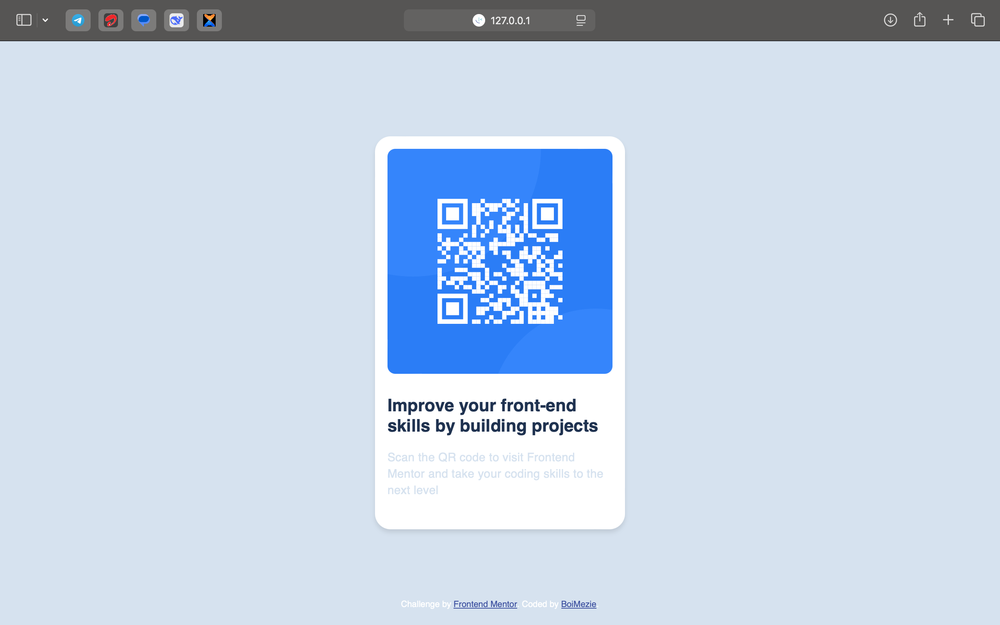
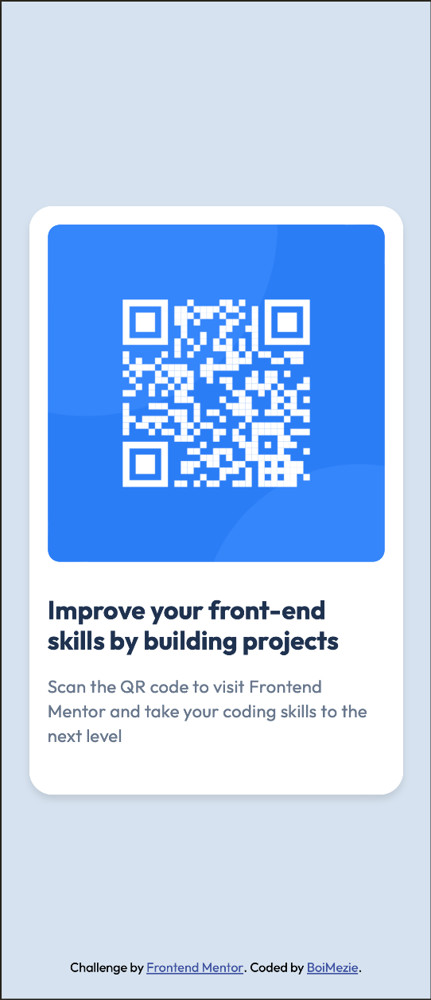

# Frontend Mentor - QR code component solution

This is a solution to the [QR code component challenge on Frontend Mentor](https://www.frontendmentor.io/challenges/qr-code-component-iux_sIO_H). Frontend Mentor challenges help you improve your coding skills by building realistic projects. 

## Table of contents

- [Overview](#overview)
  - [Screenshot](#screenshot)
  - [Links](#links)
- [My process](#my-process)
  - [Built with](#built-with)
  - [What I learned](#what-i-learned)
  - [Continued development](#continued-development)
  - [Useful resources](#useful-resources)
- [Author](#author)
- [Acknowledgments](#acknowledgments)

## Overview

This project is a simple QR code component built as part of a Frontend Mentor challenge. The goal was to create a visually appealing card that displays a QR code, a heading, and a short description, following the provided design. The component is fully responsive and uses modern web development practices to ensure accessibility and usability across devices.

### Screenshot

### Links

- Solution URL: [https://www.frontendmentor.io/solutions/responsive-landing-page-on-qr-code-component-using-css-flexbox-x1w45RSXDF](https://www.frontendmentor.io/solutions/responsive-landing-page-on-qr-code-component-using-css-flexbox-x1w45RSXDF)
- Live Site URL: [https://boimezie-qr-code-component.netlify.app/](https://boimezie-qr-code-component.netlify.app/)

## My process

### Built with

- Semantic HTML5 markup
- CSS custom properties
- Flexbox
- Mobile-first workflow

### What I learned

- Improved my understanding of semantic HTML structure for accessibility.
- Practiced using CSS custom properties for easier theme management.
- Enhanced my skills in creating responsive layouts using Flexbox and media queries.

### Continued development

- Continue practicing responsive layouts with CSS Grid and Flexbox.
- Explore more accessibility best practices.
- Experiment with adding simple animations for interactivity.

### Useful resources

- [MDN Web Docs - HTML](https://developer.mozilla.org/en-US/docs/Web/HTML)
- [MDN Web Docs - CSS](https://developer.mozilla.org/en-US/docs/Web/CSS)
- [Frontend Mentor Community](https://www.frontendmentor.io/community)

## Author

- Website - [BoiMezie](https://github.com/BoiMezie)
- Frontend Mentor - [@BoiMezie](https://www.frontendmentor.io/profile/BoiMezie)

## Acknowledgments

Thanks to Frontend Mentor for providing the challenge and to the community for feedback and support.

